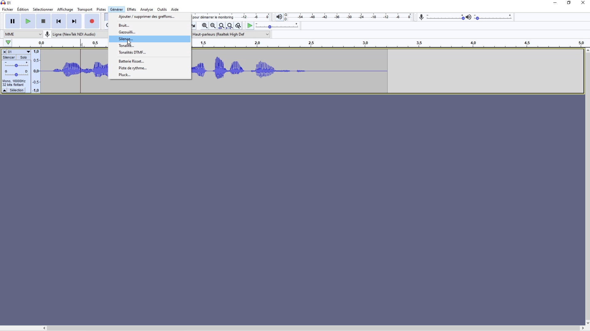
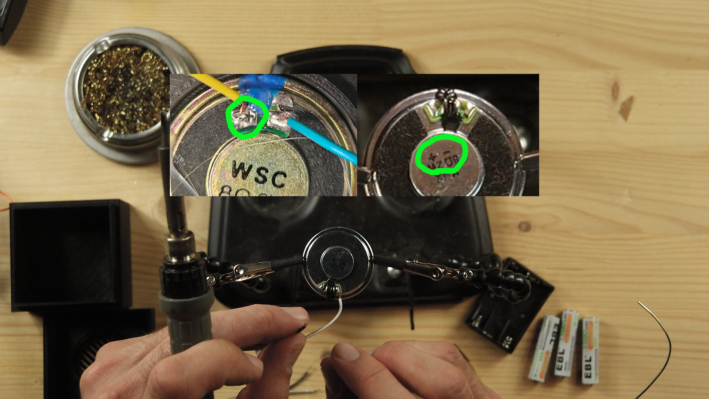
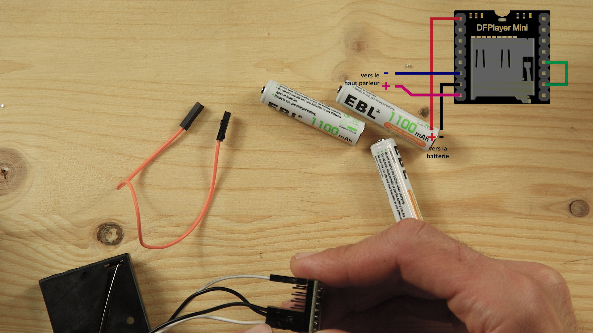

# Clameur : affordable autonomous speaker

Clameur a device inspired by the speculative fiction novel La Zone du Dehors by Alain Damasio, designed for spreading sound excerpts.

In the novel, the device is described as being the size of a fingernail, blending into urban furniture. If something or someone passes within a 10-meter radius, it activates and plays a voice, a cry, or music for a few seconds.

The goal is to spread unique, handcrafted messages. Unlike advertisements, Clameurs aim to bring poetry, smiles, and inspiration into urban spaces.
Alain Damasio on Clameurs: https://vimeo.com/26465714

Having long been drawn to this idea, I decided to create similar objects while following several principles: an open-source device that is easy to assemble and disassemble, made as much as possible from repurposed materials, requiring no specific technical knowledge, 
and above all, being affordable. This version costs around €10 per Clameur.

In this first version, I chose not to include a motion sensor system for two reasons: an infrared detector significantly increases the cost, and it makes the device more visible, making it easier to damage or steal.

you can find here a full video tutorial (in french) : https://www.youtube.com/watch?v=OZWmAGcUp1M

original post on my website : https://lerobota.com/clameurs/

---

### **material needed**

- [DF player mini](https://fr.farnell.com/dfrobot/dfr0299/dfplayer-mini-lecteur-mp3-arduino/dp/3517866?cfm=true)

- [micro SD card](https://fr.farnell.com/integral/inmsdh16g10-90sptab/16gb-microsdhc-smartphone-tablet/dp/3404090)

- 3 AAA batteries

- [3xAAA battery holder](https://fr.farnell.com/multicomp-pro/mp000340/support-batterie-aaa-cosse-a-souder/dp/3126577) 

- [F/F jumper wires](https://fr.farnell.com/pro-signal/psg-jmp150mf/cable-cavalier-150mm-rpi-breakout/dp/2452749)

- [36mm or similar flat speaker](https://fr.farnell.com/pui-audio/as03604mr-2-r/haut-parleur-550hz-11khz-4-ohms/dp/4412372)

All the links are available here, but not necessarily at the best price. second hand and reused materials is also highly encouraged.

### ***tools needed***
- soldering iron
- solder wire
- wire stripper (or possibly your teeth)

---

### **How to**

**1. Creating and Exporting the MP3**
Start by creating an audio file however you like, then use Audacity (or another software) to add silence to your audio track using the “Silence” function under the “Generate” menu.

**2. Soldering the Speaker and Battery Holder**
Strip two pairs of female-to-female jumper wires cut in half.
Solder the first pair to the speaker at the speaker’s soldering points, then solder the second pair to the pins of the battery holder, making sure to respect the + and - polarities.

**3. Assembly and Gluing**

Do a first test assembly by connecting your cables according to the diagram below.
Once everything is working properly, glue the speaker to the 3D-printed case using hot glue. Put everything together — your Clameur is ready to go!

